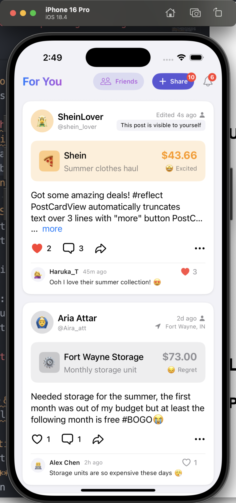
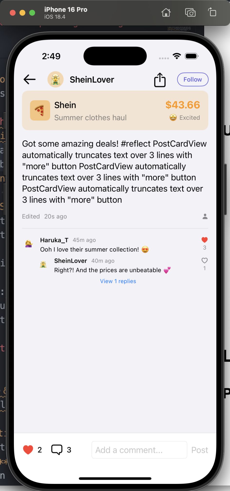

# SyvalSocial Demo - Social Spending Sharing Platform

> 🎯 **Latest Update**: Completed 
> 1. post card feed page
> 2. share post page, 
> 3. post detail page, 
> 4. comment system optimization, 
> 5. mock backend service
> 6. text truncation features and other core UI/UX improvements

A modern social spending sharing app built with **SwiftUI**, enabling users to share purchasing **experiences**, express spending emotions, and build deep **connections** with friends.

## Key Features

### Core Functions
- **Spending Post Sharing (basic)**: 
  - Publish spending experiences with amount, merchant, category, and emotions
- **Smart Comment System (advance)**: 
  - Multi-level replies with expand/collapse functionality
- **Social Interactions (advance)**: 
  - Like, comment, and share features
- **Detail Page Browsing (advance)**: 
  - Complete post details and comment section experience
- **Emotional Expression (advance)**: 
  - Track 6 different spending emotional states

### User Engagement Enhancements
- **Smart Text Truncation**: 
  - PostCardView automatically truncates text over 3 lines with "more" button
- **Seamless Navigation**: 
  - Tap card button to navigate to detail page
- **Optimized Comment System**: 
  - Card shows only latest comment preview
  - Detail page supports full comment expand/collapse
  - Smart "View X replies" button based on reply count
- **Intuitive Layout**: 
  - Modern design language card style feed list with smooth micro-interactions

## Latest Feature Updates

### PostCardView
- ✅ **Text Truncation & "More" Button**: Auto-truncate after 3 lines with blue highlighted "more" button
- ✅ **Card Tap Navigation**: Entire card area supports tap to navigate to detail page
- ✅ **Comment Preview**: Shows only latest comment to keep interface clean
- ✅ **Heart Icon Optimization**: Adjusted comment section heart icon size and position

### PostDetailView Detail Page
- ✅ **Complete Content Display**: Shows full post title and content
- ✅ **Top Navigation Bar**: Back button, author avatar, Follow/Share buttons
- ✅ **Comment Section Optimization**: 
  - Default shows first sub-comment
  - Shows "View X replies" button when more than 1 sub-comment
  - Supports comment like functionality
- ✅ **Bottom Comment Panel**: Fixed at screen bottom with Like and Comment interactions

### Comment System Logic
- ✅ **Smart Reply Expansion**: 
  - 0 replies: No additional content shown
  - 1 reply: Directly displayed, no expand button
  - 2+ replies: Shows first reply + expand button (displays remaining count)
- ✅ **Data Consistency**: PostCardView and PostDetailView use same comment data source
- ✅ **Layout Optimization**: Expand button position adjustment, indentation optimization

## Design Tradeoffs & Decisions

### UI/UX Tradeoffs
- **Text Truncation vs Full Content**
  - ✅ **Chosen**: 3-line truncation with "more" button
  - ❌ **Alternative**: Show full text always
  - **Reasoning**: Improves feed scan-ability and reduces cognitive load, despite requiring extra tap for full content

- **Comment Preview vs Complete Comments**
  - ✅ **Chosen**: Show only latest comment in feed
  - ❌ **Alternative**: Show all comments in feed
  - **Reasoning**: Keeps feed focused on posts while encouraging detail page visits for deeper engagement

### Technical Tradeoffs
- **Mock Data vs Real Backend**
  - ✅ **Chosen**: MockDataService for initial development
  - ❌ **Alternative**: Implement real API from start
  - **Reasoning**: Faster prototyping and UI iteration, with planned backend integration in Phase 2

- **MVVM vs Other Architectures**
  - ✅ **Chosen**: MVVM with Combine
  - ❌ **Alternative**: Redux-like state management
  - **Reasoning**: Better alignment with SwiftUI patterns and simpler debugging

### Performance Tradeoffs
- **Memory vs User Experience**
  - ✅ **Chosen**: Cache comment trees in memory
  - ❌ **Alternative**: Fetch comments on demand
  - **Reasoning**: Smoother expand/collapse animations at cost of memory usage

### User Engagement Tradeoffs
- **Simplicity vs Feature Richness**
  - ✅ **Chosen**: Limited initial feature set with polished experience
  - ❌ **Alternative**: Feature-heavy initial release
  - **Reasoning**: Lower learning curve and higher completion rates


## Technical Architecture

### Tech Stack
- **Frontend Framework**: SwiftUI (iOS 16.0+)
- **State Management**: Combine + MVVM Architecture
- **Data Processing**: MockDataService simulating backend API
- **UI Components**: Modular reusable component design

### Project Structure
```
SyvalSocial/
├──  Models/
│   ├── SpendingPost.swift      # Spending post data model
│   └── Notification.swift     # Notification data model
├──  Services/
│   └── MockDataService.swift  # Mock data service
├──  ViewModels/
│   └── FeedViewModel.swift    # Feed view model
├──  Views/
│   ├── FeedView.swift         # Main feed page
│   ├── CreatePostView.swift   # Create post page
│   ├── PostDetailView.swift   # Post detail page
│   ├── NotificationCenterView.swift # Notification center
│   └──  Components/
│       └── PostCardView.swift # Post card component
└──  Assets.xcassets/        # Asset files
```

### Core Components

#### PostCardView Card Component
```swift
struct PostCardView: View {
    // Supports text truncation and navigation
    // Smart comment preview
    // Complete social interaction features
}
```

#### PostDetailView Detail Page
```swift
struct PostDetailView: View {
    // Complete content display
    // Multi-level comment system
    // Bottom interaction panel
}
```

#### TruncatedTextView Text Truncation Component
```swift
struct TruncatedTextView: View {
    // Auto-detect text length
    // Smart "more" button display
    // Navigation callback support
}
```

## Design System

### Color System
- **Category Colors**: Each spending category has unique theme colors
- **Emotion Colors**: Visual expressions for different emotional states
- **Interaction Colors**: Unified like red, link blue, etc.

### Animation System
- **Micro-interactions**: Smooth animations for likes, expand/collapse
- **Transition Animations**: Natural transitions between pages
- **Feedback Animations**: Instant visual feedback for user actions

## Data Models

### SpendingPost Spending Post
```swift
struct SpendingPost {
    let id: UUID
    let user: User
    let amount: Double
    let merchantName: String
    let category: SpendingCategory
    let description: String
    let emotion: EmotionType
    let caption: String
    var likesCount: Int
    var commentsCount: Int
    var sharesCount: Int
    let isPrivate: Bool
    let location: String?
    let timestamp: Date
}
```

### Comment Comment System
```swift
struct Comment {
    let id: UUID
    let user: User
    let content: String
    let timestamp: Date
    var likesCount: Int
    var isLikedByCurrentUser: Bool
    var replies: [Comment]
}
```


## Development Progress Dashboard

### Completed Features (Phase 1)
- [x] Basic spending post publishing
- [x] Feed browsing
- [x] Social interactions (like, comment, share)
- [x] Emotional state recording
- [x] PostCardView text truncation optimization
- [x] PostDetailView detail page
- [x] Comment system optimization
- [x] Navigation flow completion
- [x] UI/UX detail optimization

### Under Development (Phase 2)
- [ ] User follow system
- [ ] Push notifications
- [ ] Search functionality
- [ ] User profile page

### Planned Features (Phase 3)
- [ ] AI spending suggestions
- [ ] Emotion trend analysis
- [ ] Spending challenge activities
- [ ] Third-party integrations

## Product Vision

### Core Values
1. **Emotion-Driven**: Not just sharing spending data, but the emotional experiences behind spending
2. **Social Validation**: Get spending decision support through friend feedback
3. **Transparent Culture**: Build healthy money conversation environment
4. **Personalized Insights**: Provide personalized suggestions based on social data

### User Experience Goals
- **Simple & Intuitive**: Easy operation flow, clear interface
- **Emotional Resonance**: Support rich emotional expressions
- **Social Interaction**: Encourage meaningful exchanges
- **Privacy & Security**: Flexible privacy control options

## Technical Implementation Challenges

### Reactive Architecture
```swift
// Data flow management using Combine
@Published var posts: [SpendingPost] = []
@Published var comments: [Comment] = []

// Automatic UI updates
dataService.$posts
    .assign(to: \.posts, on: self)
    .store(in: &cancellables)
```

### Component Design
```swift
// Reusable UI components
TruncatedTextView(text: caption, lineLimit: 3) {
    // Navigate to detail page
    showingPostDetail = true
}
```

### Smart State Management
```swift
// Comment expansion logic
if comment.replies.count > 1 && !isExpanded {
    Button("View \(comment.replies.count - 1) replies") {
        onToggleExpand()
    }
}
```

## Interface Screenshots

|  |  |
| ------------- | ------------- |


## Contact

- **Autho Githubr**: yousanflics
- **Email**: yousanflics@gmail.com


---
  
**Last Updated**: January 2025  
